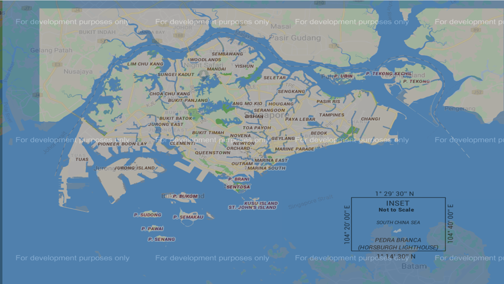

# OneMap

Welcome to my website. In this repository, I am showing a few snippets of code to help display OneMap. 

return "https://maps-a.onemap.sg/v3/Night/" +

This line changes the  Default Map to Night

